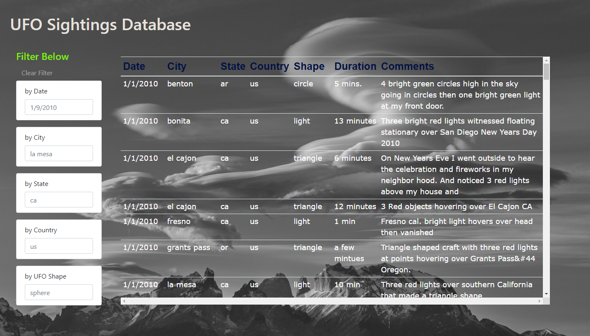

## javascript-challenge
# UFO Sightings Database
## JavaScript, HTML, CSS, D3.js
 
This project combines JavaScript, HTML, CSS, D3.js to create a dynamic webpage that allows users to explore UFO sightings data.
  

## HTML and CSS
### The initial setup for the site uses HTML, CSS, and Bootstrap.  
 - The layout was created in HTML (file:  **index.html**) and includes the title, header, and forms for the filters.
 - The style for the page was then added using CSS (file:  **static/css/style.css**) and includes the fonts, colors, and background image.
 - The table was created using Bootstrap.  The table header was hard coded into the html (Date, City, State, etc.) but the table body was left empty.  The data that is presented in the table rows is loaded dynamically using JavaScript and D3.js

 Date | City | State | Country | Shape | Duration | Comments
 -----| -----|-------|---------|-------|----------|---------

 

## JavaScript and D3.js
### JavaScript and D3.js make the page dynmaic.
- The JavaScript that directs all the action is located here:  **static/js/app.js**
- The first thing the JavaScript does is load all the raw data.  The raw data for this site lives here:  **static/js/data.js**
 
### Once the page is launched and the table is populated with data, D3.js adds the filter functionality.  Users can filter the UFO sightings data by Date, City, State, Country, and UFO shape. 
##### D3.js handles the events:
    * __Clear Filter button__:  The Clear Filter button clears the contents of the table and reloads the raw data found in the **data.js** file.
    * __Filter by forms__:  There are five forms on the left side of the page that users can use to filter the UFO Sightings data.  When a user enters specific criteria in the form (for example: a specific date), D3.js clears the table and returns the sightings that fit the criteria the user entered.

 

